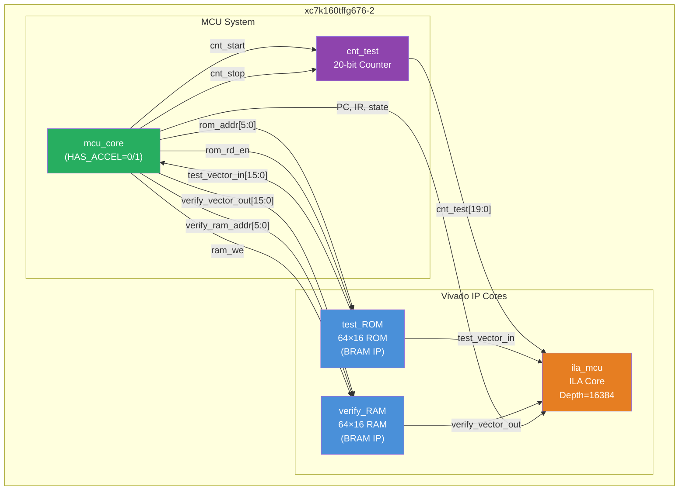
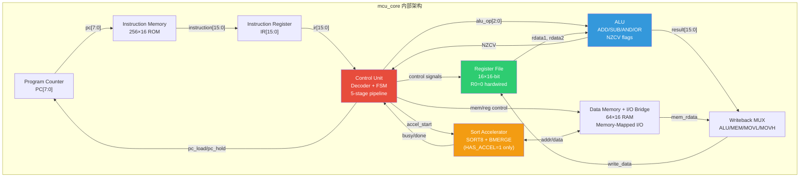
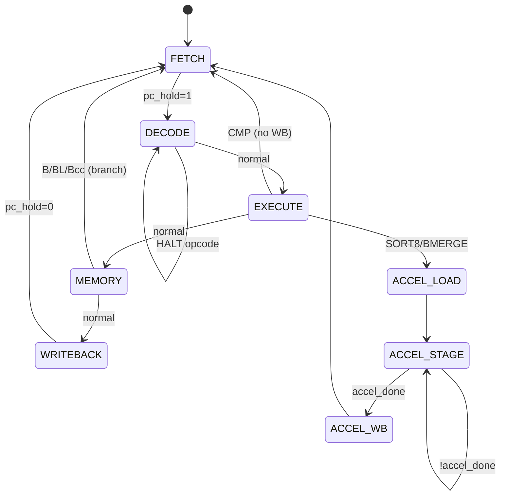
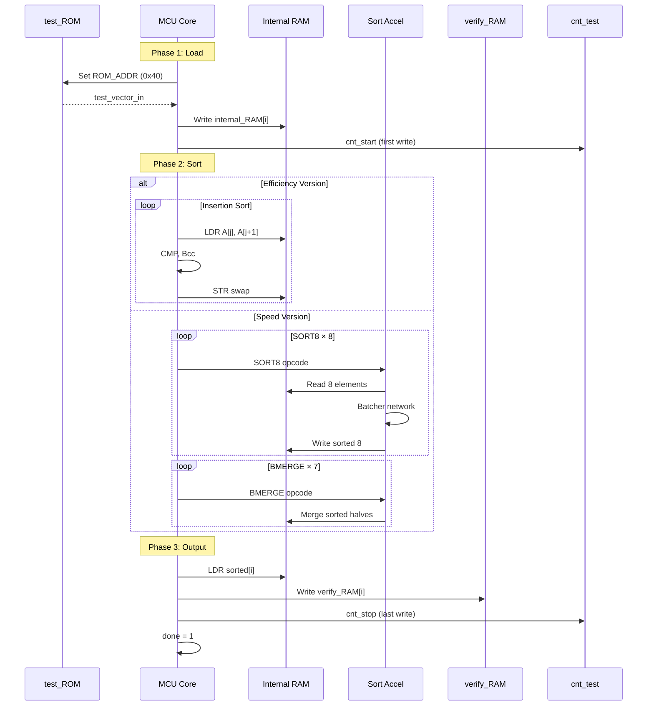
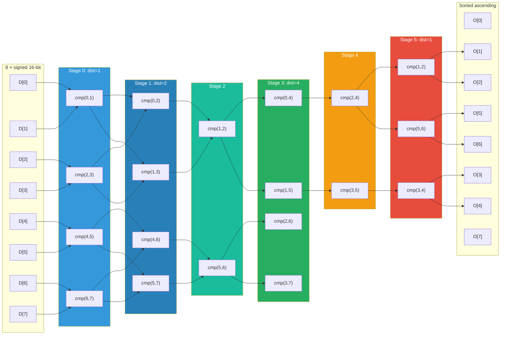
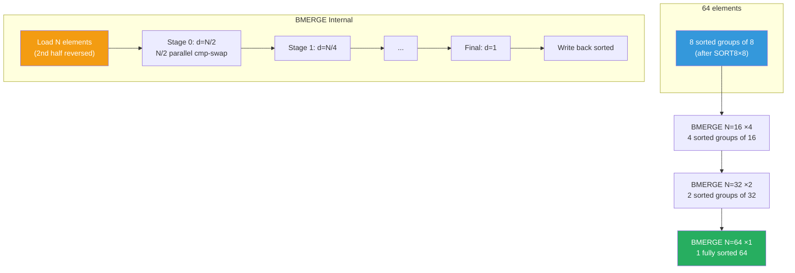
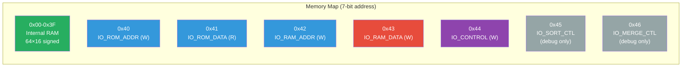
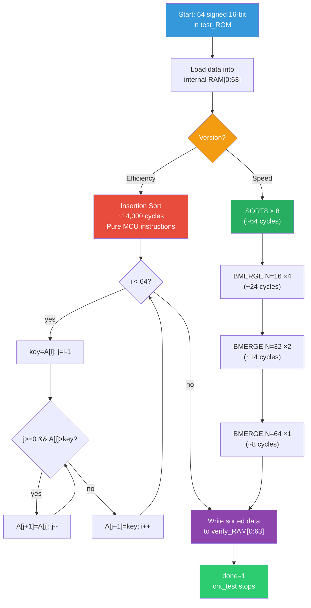

# MCU 排序工程 — 架构图与流程图

## 1. 顶层系统架构

## 2. MCU Core 内部架构

## 3. 指令流水线状态机

## 4. 完整数据流

## 5. SORT8 Batcher Odd-Even 排序网络

## 6. BMERGE 合并流程 (N=64)

## 7. Memory-Mapped I/O 地址空间

## 8. Efficiency vs Speed 对比流程

## 9. 地址位宽规范

| Signal | Width | Range |
|--------|-------|-------|
| `mcu_data_addr` | [6:0] | 0-127 |
| `internal_mem_addr` | [5:0] | 0-63 |
| `rom_addr` | [5:0] | 0-63 |
| `verify_ram_addr` | [5:0] | 0-63 |
| `PC` | [7:0] | 0-255 |
| `test_vector_in` | [15:0] | signed 16-bit |
| `verify_vector_out` | [15:0] | signed 16-bit |
| `cnt_test` | [19:0] | 0-1,048,575 |
| `instruction` | [15:0] | 16-bit fixed |

## 10. 指令编码 (16-bit)

| Opcode | Mnemonic | Format | Description |
|--------|----------|--------|-------------|
| 0000 | ADD | RRR | Rd = Rs1 + Rs2 |
| 0001 | SUB | RRR | Rd = Rs1 - Rs2 |
| 0010 | AND | RRR | Rd = Rs1 & Rs2 |
| 0011 | OR | RRR | Rd = Rs1 \| Rs2 |
| 0100 | MOVL | I8 | Rd = {8'h00, imm8} |
| 0101 | MOVH | I8 | Rd = {imm8, Rd[7:0]} |
| 0110 | LDR | RRR | Rd = mem[Rs1+Rs2] |
| 0111 | STR | RRR | mem[Rs1+Rs2] = Rd |
| 1000 | CMP | RRR | Rs1-Rs2 → NZCV |
| 1001 | B/BL | J12 | PC += sext(imm11), L=link |
| 1010 | HALT | — | done=1, stop |
| 1011 | Bcc | B | if(cond) branch |
| 1100 | ADDI | I4 | Rd = Rs1 + imm4(0-15) |
| 1101 | SUBI | I4 | Rd = Rs1 - imm4(0-15) |
| 1110 | SORT8 | RRR | HW sort 8 (speed) |
| 1111 | BMERGE | RRR | HW merge (speed) |
